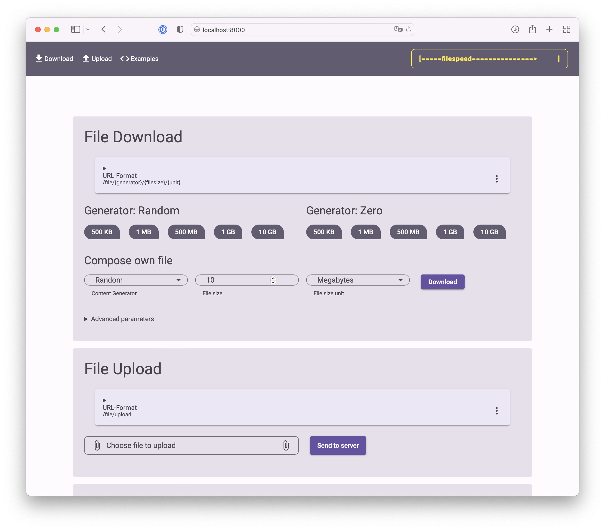

# Filespeed
## HTTP payload generator for client-side speed tests and connection benchmarks

The simplest speed test: Download a file!  
However, many solutions generate test files in-advance and serve them via a webserver. Consequently, the larger the files you want to provide, the more disk space you need to statically allocate to store them. Especially in cloud-native environments, where your speed test server can be deployed on multiple nodes, this is a challenge.  
  
Filespeed simply generates the served file content on-the-fly using generators. The goal of Filespeed is to enable performance measurements based on existing methods (file/block download) rather than inventing a new speed test client. It uses a common HTTP webserver that will serve your requests. On your client, you can use any performance-optimized tool of your choice: Your browser, curl, wget, ... Check the `Client examples` section below as well as `client_examples` directory for usage examples. Filespeed also offers the possibility to upload files using the HTTP post method.  
  
Filespeed offers an index page with download links of example sizes. For more flexibility, you can easily download a file generated with your desired characteristics using the Filespeed URL format. The file content can be generated online with random bytes (from `/dev/urandom`) or using simple zeros (null bytes). Zeroes are created faster than random bytes, however, random content is probably closer to a realistic scenario. Moreover, random content traffic is hard to optimize or compress (e.g., by WAN optimizers or gzip compression).  

### Features
- dynamic file content generation with URL parameter based configuration
- multiple payload generators: random and zero bytes
- support of http1.1, http2.0 (without TLS/SSL) and http3/quic (with TLS/SSL). All via seperate ports.
- compression disabled
  
Source on GitHub: https://github.com/firefrei/filespeed  
Image on Docker Hub: https://hub.docker.com/r/firefrei/filespeed  


## Run using Docker
```bash
docker run --rm --name filespeed firefrei/filespeed
```

Access http://localhost:8000 in your browser!
  
The default ports are:
- 8000 for insecure http (HTTP 1.0/1.1)
- 8001 for secure https (HTTP 1.1/2.0)
- 8002 for QUIC via HTTP3 (only!)


## Client examples

Using curl:
```bash
# Download
curl --output /dev/null http://localhost:8000/file/random/10/gb

# Upload
dd if=/dev/urandom bs=1000 count=100000 | curl -w '%{json}' --data-binary @- http://localhost:8000/file/upload

# Optional parameters:
#   --http1.1     -> force http version 1.1 (mostly default)
#   --http2       -> force http version 2 which supports multiplexing (recommended to use HTTPS port)
#   --http3       -> force http version 3 with quic
```

Using wget:
```bash
wget -O /dev/null http://localhost:8000/file/random/10/gb

# Optional parameters:
#   --report-speed=bits     -> report measured rate in bit rather than bytes per second
```

Using [robot framework](https://robotframework.org):
```bash
robot --variable HOST:localhost:8000 client_examples/filespeedtest.robot
# Optional parameters:
#   --variable SIZE:100              -> amount of data to download and upload in mb
#   --variable GENERATOR:random      -> filespeed generator to use for downloads
#   --variable TEST_DL_RATE:50       -> minimum average download rate in mbps
#   --variable TEST_UL_RATE:30       -> minimum average upload rate in mbps
#   --variable TEST_DL_DURATION:600  -> maximum time in seconds the download may take (timeout)
#   --variable TEST_UL_DURATION:600  -> maximum time in seconds the upload may take (timeout)
```

## Dependencies
Filespeed is shiped with a compiled and minified version of [beercss](https://github.com/beercss/beercss), which is licensed under MIT.

## Screenshot

